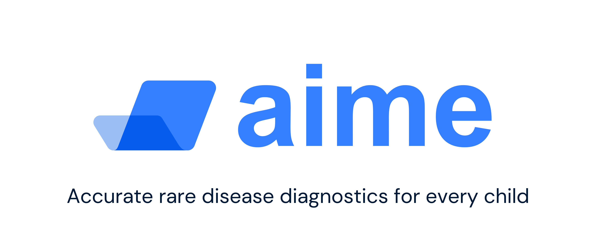
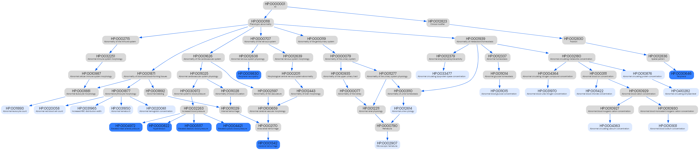

# 🦆legent



## Setup

Install dependencies

```
pip install -r ./requirements.txt
```

Run the notebook [`setup.ipynb`](setup.ipynb) which downloads the data and inserts the Human Phenotype Ontology features.

## Neural Network Training

The code to configure and run the neural network training is located in the [`project_notebook.ipynb`](project_notebook.ipynb).

## Slides

- The [Pitch deck](AIME_pitch_deck.pdf)
- The [Reading deck](AIME_reading_deck.pdf) provides more detailed information

## HPO Feature Graph

Shows all HPO features associated with blood values of patient 10026 in light blue and all diagnoses of patient 10026 in dark blue.


